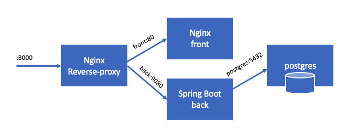

# Docker workshop

Simple exercise to combine some services on containers:
- database
- backend Java Spring Boot
- frontend HTML on nginx + Ajax call
- reverse proxy with nginx




Build each container on every sub-folder (more info in each README.md)

You can start each service on their own or with the provided `docker-compose.yaml` file

To run the database you can just execute:

```
docker run --name postgres -e POSTGRES_PASSWORD=postgres -d postgres:10
```

